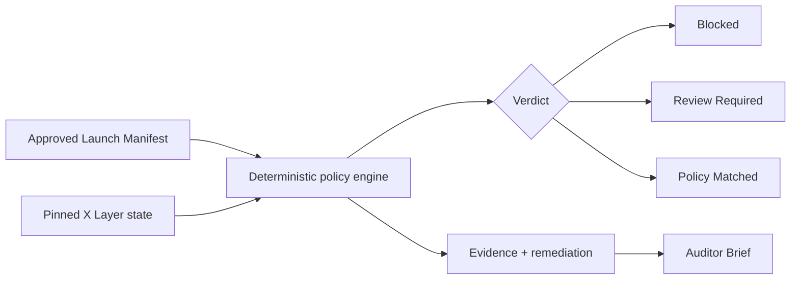
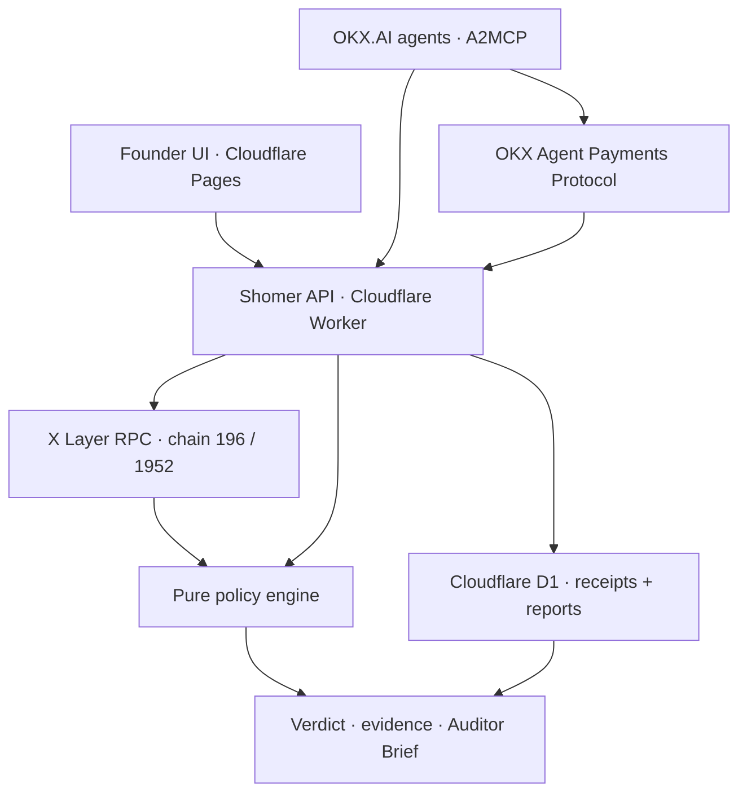

<p align="center">
  
</p>

<h1 align="center">Shomer</h1>

<p align="center">
  <strong>The X Layer Ship Gate.</strong><br />
  Agents and founders verify that the contract you actually shipped matches the policy you approved.
</p>

<p align="center">
  <a href="https://www.okx.ai/agents/6117"></a>
  <a href="https://www.okx.com/xlayer"></a>
  <a href="https://github.com/Ololadestephen/Shomer/actions/workflows/ci.yml"></a>
</p>

<p align="center">
  <a href="https://shomer-ui.pages.dev"><strong>Open Shomer</strong></a>
  &nbsp;·&nbsp;
  <a href="https://shomer-agent-api.mixed-mouse.workers.dev/api/agent"><strong>Inspect the agent API</strong></a>
  &nbsp;·&nbsp;
  <a href="docs/demo/bundle/DEMO-SHOTLIST.md"><strong>Run the 90-second demo</strong></a>
</p>

---

## The dangerous part often happens after the audit

A team can write acceptable contracts and still launch the wrong system:

- the deployed owner is a personal wallet instead of the approved Safe;
- the proxy admin or UUPS upgrader is different from the reviewed authority;
- the implementation bytecode is not the artifact the auditor reviewed;
- a timelock is missing or shorter than policy;
- the treasury, fee recipient, oracle, router, pool, mint authority, or supply differs from the launch plan.

Traditional audit tooling asks **“Is this code vulnerable?”** Shomer asks a different, release-critical question:

> **What did the team approve, and does the real onchain deployment match it at this block?**

Shomer is not an AI auditor, never claims a contract is safe, and does not replace human review. It is the deterministic gate between reviewed intent and deployed reality.

---

## One manifest. One chain snapshot. One honest verdict.



1. A founder or agent declares the expected deployment policy.
2. Shomer reads X Layer state at one pinned block.
3. A pure TypeScript engine compares declared rules with observed facts.
4. Every result includes expected value, actual value, evidence source, why it matters, and remediation.
5. The team fixes blockers, reruns the gate, and shares the evidence package with a human reviewer.

### Verdict semantics

| Verdict | Meaning | Automation rule |
| --- | --- | --- |
| **Blocked** | A deterministic hard-policy violation exists | Do not ship or trust the deployment |
| **Review Required** | Evidence is incomplete, a privilege is undeclared, or human judgment is required | Never auto-approve |
| **Policy Matched** | Every declared hard rule that could be evaluated matched the pinned state | Means policy matched—never “safe” or “audited” |

Blank rules are **out of scope**, not green checks. Declared rules with missing evidence prevent **Policy Matched**. Live imports create drafts only and can never approve themselves.

---

## See the product in 90 seconds

The fastest judge/reviewer path is completely offline: no RPC variability, wallet, payment, or secrets.

```bash
npm install
npm run demo:bundle
```

Then open [`docs/demo/bundle/DEMO-SHOTLIST.md`](./docs/demo/bundle/DEMO-SHOTLIST.md). The generated pack uses the same X Layer contract shape and pinned block for all three outcomes:

| Scenario | Policy change | Expected result | Evidence |
| --- | --- | --- | --- |
| Correct approved owner | Owner equals observed owner | **Policy Matched** | [`matched.json`](./docs/demo/bundle/matched.json) |
| Wrong approved owner | Owner intentionally differs | **Blocked** | [`blocked.json`](./docs/demo/bundle/blocked.json) |
| Undeclared pauser | Owner matches, `PAUSER_ROLE` is undeclared | **Review Required** | [`review.json`](./docs/demo/bundle/review.json) |

Each path includes a pinned-block Auditor Brief. The paid segment adds a privilege map and reviewed runtime-code comparison.

---

## Production proof, not a mock payment

Shomer’s paid flow has settled on X Layer mainnet and recovered its report after the original client response was lost.

| Proof | Production result |
| --- | --- |
| Contract | `0x5839244eab49314bccc0fa76e3a081cb1a461111` |
| Pinned block | `65954437` |
| Reviewed runtime hash | `0x3b19c4c11b459cd1e52f991bbbe78a64b869aeaa7f483f3ab0c12d84120eee64` |
| Artifact comparison | **Matched** |
| Deployment verdict | **Blocked**—observed owner was the zero address |
| Auditor Brief | `shomer-196-65954437-1ba7f41efd1f` |
| X Layer payment | `0x665b7725059f61140ff2f39388feb7120e27691102c5cce05f7e7ea87a547987` |
| Recovery | Persisted report returned without a second payment |

This is an important product property: **matching reviewed bytecode does not override a deployment-policy blocker**.

The public, sanitized proof — contract, payment transaction, recovered report, and verdict — is in [`payment-proof.sanitized.json`](./docs/demo/bundle/payment-proof.sanitized.json). It contains no payment authorization, receipt capability, API key, or wallet credential.

---

## Founder experience

The frontend turns deployment verification into a calm release workflow:

1. **Read onchain state** — paste an X Layer address or start from a repository/artifact.
2. **Build the Launch Manifest** — owner, Safe, upgrades, timelock, implementation, treasury, token, oracle, and integration rules.
3. **Approve version N** — freeze an immutable policy snapshot.
4. **Run the ship gate** — compare that snapshot with a single live block.
5. **Fix and rerun** — blockers include exact remediation.
6. **Export the Auditor Brief** — share evidence without claiming an audit.

The UI stores founder policy state locally. Shomer never takes custody of a wallet, private key, or deployment transaction.

---

## Agent-native on OKX.AI

Shomer is listed as **ASP #6117** and exposes free and paid A2MCP services from an always-on Cloudflare Worker.

**Base URL:** `https://shomer-agent-api.mixed-mouse.workers.dev`

### Free Ship Gate

| Capability | Method and path |
| --- | --- |
| Service catalog | `GET /api/agent` |
| Policy packs | `GET /api/agent/packs` |
| Read deployment facts | `POST /api/agent/read` |
| Build an unapproved draft | `POST /api/agent/draft` |
| Verify policy | `POST /api/agent/verify` |
| Composite automation gate | `POST /api/agent/ship-gate` |

```bash
curl -sS -X POST \
  https://shomer-agent-api.mixed-mouse.workers.dev/api/agent/verify \
  -H 'Content-Type: application/json' \
  -d '{
    "network": "mainnet",
    "contractAddress": "0x5839244eab49314bccc0fa76e3a081cb1a461111",
    "policy": { "upgradeable": false },
    "projectName": "Production check"
  }'
```

The response exposes `verdict`, `coverage`, `policyHash`, pinned `blockNumber`, observable `facts`, and `results[].evidence`.

For automation, `shipGate.allowed` becomes `true` only when:

- the verdict is exactly `policy_matched`;
- `approvedPolicy: true` was supplied; and
- the request contains substantive explicit rules—not live-filled defaults.

### Paid Deep Verification (Shomer Deep Verify)

`POST /api/agent/verify/paid` costs **$0.05 USDC on X Layer** (`eip155:196`) through the **OKX Agent Payments Protocol**. Marketplace listing and x402 challenge use the **same** amount (display may show USDT; settlement is USDC).

It uses the same deterministic verdict engine and adds:

- a bounded multi-contract **privilege map**;
- reviewed runtime/implementation address and code-hash comparison;
- an **Auditor Brief** in structured JSON and Markdown;
- a content digest and pinned evidence index;
- durable payment transaction and report recovery.

The HTTP 402 metadata declares business parameters as JSON-body fields. Scalar artifact aliases are available for A2MCP clients that cannot serialize nested known parameters.

```json
{
  "network": "mainnet",
  "contractAddress": "0x…",
  "blockNumber": 65954437,
  "reviewedRuntimeCodeHash": "0x…",
  "reviewedArtifactName": "Reviewed Foundry runtime"
}
```

On success, Shomer returns a transaction hash, report ID, and capability-style recovery URL. The authorization header is never stored. Reusing one authorization for a different body returns a replay mismatch instead of another report.

See [`docs/AGENT-SKILL.md`](./docs/AGENT-SKILL.md) for the complete agent playbook.

---

## Deterministic checks

| Policy surface | Onchain evidence |
| --- | --- |
| Chain and deployer | `eth_chainId` plus deployment creation evidence when available |
| Owner and Safe | `owner()`, Safe owners, threshold, and code classification |
| Proxy and upgrade authority | EIP-1967 implementation/admin slots and UUPS signals |
| Timelock | `getMinDelay()` on governance candidates |
| Reviewed implementation | Address plus `keccak256` runtime bytecode |
| Initializer | Common Initializable state where deterministically readable |
| Token controls | Supply, mint authority, and fee recipient |
| Protocol integrations | Treasury, oracle, router, factory, and pool allowlists |
| Bounds | Oracle staleness, fees, and slippage |
| Sanity | Zero/dead/placeholder addresses, missing code, and chain mismatch |
| Verification record | Source/artifact status is recorded; absence requires review |
| Privileges | Common AccessControl roles are surfaced; undeclared roles require review |

Static analysis can be added as supporting evidence later, but scanner findings never silently become deterministic launch blockers. AI may explain evidence; it does not invent vulnerabilities or decide the verdict.

---

## Architecture



| Layer | Implementation |
| --- | --- |
| Founder UI | Vite + TypeScript, local policy state, Cloudflare Pages |
| Chain adapter | `viem`, X Layer RPC, EIP-1967/Safe/AccessControl probes |
| Policy engine | Pure TypeScript under `src/lib/policy` |
| Agent API | Cloudflare Worker under `workers/agent-api` |
| Payment recovery | Cloudflare D1 migration-backed receipt store |
| Payments | OKX Agent Payments Protocol v2, USDC on X Layer |

---

## Run locally

```bash
git clone https://github.com/Ololadestephen/Shomer.git
cd Shomer
npm install
cp .env.example .env
npm run dev
```

Useful commands:

```bash
npm run build            # production UI build
npm run test:ci          # complete deterministic gate
npm run demo:golden      # three pinned verdict paths
npm run demo:bundle      # sanitized recording pack
npm run test:live:xlayer # opt-in live X Layer reads
npm run test:live:x402   # live payment challenge; no charge by default
npm run worker:deploy    # always-on A2MCP API
npm run pages:deploy     # public founder UI
```

CI runs without RPC, explorer, wallet, facilitator, or payment dependencies. Live-chain and paid replays remain explicit opt-in operations.

---

## Repository map

| Path | Purpose |
| --- | --- |
| [`src/lib/policy`](./src/lib/policy) | Manifest types, policy packs, pure verdict engine |
| [`src/lib/adapters/xlayer.ts`](./src/lib/adapters/xlayer.ts) | Pinned X Layer evidence reads |
| [`server/agentVerify.ts`](./server/agentVerify.ts) | Shared free/paid verification service |
| [`server/x402.ts`](./server/x402.ts) | Payment challenge, verification, and settlement |
| [`server/paymentReceipts.ts`](./server/paymentReceipts.ts) | Idempotent report and transaction recovery |
| [`workers/agent-api`](./workers/agent-api) | Production Worker and D1 migration |
| [`scripts/demo-bundle.ts`](./scripts/demo-bundle.ts) | Secret-free recording evidence generator |
| [`docs/demo/bundle`](./docs/demo/bundle) | Ready-to-record verdict and payment proofs |

---

## Security boundaries

- No wallet custody, private keys, or automated deployment.
- Payment authorization material is never persisted.
- Request bodies are hash-bound to receipts; mismatched replay fails closed.
- Related-address privilege probes are capped to prevent unbounded fan-out.
- Raw evidence remains visible behind every summary.
- “Policy Matched” is never rewritten as “safe,” “secure,” or “audited.”

## Roadmap

Next: Foundry/Hardhat plugins, GitHub checks, reviewed-commit versus deployed-bytecode comparison, reusable policy packs, and Shomer Watch for post-launch privilege drift.

---

## Built for OKX.AI Genesis

Shomer is live on X Layer, listed on OKX.AI as **ASP #6117**, callable by other agents through A2MCP, and monetized through an onchain USDC payment that has been proven in production.

> **Shomer verifies the deployment you intended to ship.**

### Documentation

- [`FREE-VS-PAID.md`](./docs/FREE-VS-PAID.md) — product and pricing boundary
- [`AGENT-SKILL.md`](./docs/AGENT-SKILL.md) — instructions for calling agents
- [`ASP.md`](./docs/ASP.md) — deployment, discovery, and payment integration
- [`TESTING.md`](./docs/TESTING.md) — deterministic, live-chain, and paid proof gates
- [`DEMO-AND-X-POST.md`](./docs/DEMO-AND-X-POST.md) — submission script and social copy

---

<p align="center">
  <strong>Not an audit. Never “safe.” Evidence for the deployment decision.</strong>
</p>
